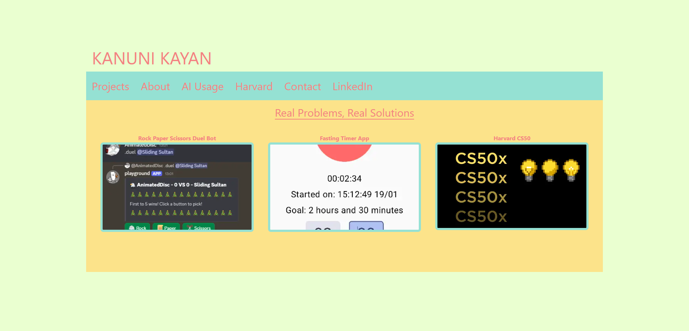

# Portfolio version 1

This project was created using Next.js

## Introduction

This was version 1 of the Kanuni Kayan Portfolio website.
It featured the essentials of a portfolio.

It served as a starting ground to which we can later on revamp or add onto.

## Table of Contents
- [Introduction](#introduction)
- [About](#about)
- [Screenshots](#screenshots)
- [Navigation](#nagivation)
- [Version 2](#version 2)
- 
## Screenshot

Landing page

## Navigation

The nav bar has sections:
- Projects
- About
- AI Usage
- Harvard
- Contact
- LinkedIn

Each section displays information about its respective piece.
Only the content within the yellow box is changed, as I have used
layout and page elements to mix and share components using Next.js.

## Version 2

Check out version 2 of the portfolio website here:
- [Website](https://www.kanunikayan.com/)
- [GitHub](https://github.com/KanuniKayan/portfolio_v2)